# Architecture overview

MediaForge is a video transcoding application with a Go backend, embedded web UI, and FFmpeg for video processing.

## Core data flow

MediaForge has two entry points into the same job queue: a **manual** path (user
adds files via the web UI) and an **automated ingest** path (the watched-folder
pipeline identifies and routes files on its own). Both converge on the same
worker pool / FFmpeg / SQLite core, and both route failures to the Review Queue
rather than failing silently.

```mermaid
flowchart LR
    subgraph UI["Web UI"]
        B[Browser]
    end

    subgraph Ingest["internal/intake"]
        WATCH[Watcher] --> ID[Identify<br/>TMDB/TVDB/OMDb/LLM]
        ID --> UPG[internal/upgrade<br/>duplicate check]
    end

    subgraph API["API Layer"]
        H[HTTP<br/>Handler]
        SSE[SSE<br/>Stream]
    end

    subgraph Core["Processing Core"]
        Q[(Job<br/>Queue)]
        W[Worker<br/>Pool]
    end

    subgraph Storage["Persistence"]
        DB[(SQLite)]
    end

    subgraph Transcode["FFmpeg"]
        FF[FFmpeg<br/>Process]
    end

    RQ[Review Queue]

    B -->|REST| H
    B <-->|Events| SSE
    H --> Q
    WATCH -->|HEVC: direct| Library[Library]
    WATCH -->|AVC: stage + enqueue| Q
    ID -->|low confidence / no match| RQ
    UPG -->|ambiguous duplicate| RQ
    Q --> W
    W --> FF
    W -->|failure| RQ
    Q <--> DB
    SSE --> Q

    style UI fill:#1e3a5f,stroke:#4a9eff
    style Ingest fill:#5f4a3a,stroke:#ffb88a
    style API fill:#2d4a3e,stroke:#6bcf8e
    style Core fill:#4a3a5f,stroke:#b88aff
    style Storage fill:#5f3a3a,stroke:#ff8a8a
    style Transcode fill:#3a4a5f,stroke:#8ab4ff
    style RQ fill:#5f3a3a,stroke:#ff8a8a
```



**Manual request flow:**

1. User selects files in web UI and picks a preset
2. Browser POSTs to `/api/jobs` with file paths
3. Handler probes files with FFmpeg, adds jobs to queue
4. Workers pick up pending jobs and spawn FFmpeg processes
5. Progress updates flow back via SSE to update the UI
6. Completed jobs update SQLite and broadcast completion

**Automated ingest flow:**

1. `internal/intake`'s watcher detects a new file in the watched folder and waits for it to stabilize
2. Codec is detected via ffprobe; HEVC/AV1 routes toward the library, everything else toward the encode queue
3. Metadata lookup (TMDB/TVDB/OMDb, with optional LLM verification for low-confidence matches) identifies the title
4. A duplicate-at-destination check (`internal/upgrade`) auto-resolves unambiguous upgrades or routes ambiguous ones to the Review Queue
5. HEVC files move straight to the library; AVC files are staged and added to the same job queue the manual path uses
6. Any failure at any step — codec detection, lookup, duplicate resolution, encode, move — routes to the Review Queue with a specific reason; nothing is dropped silently

## Package structure

```
mediaforge/
├── cmd/mediaforge/    # Entry point, CLI flags
├── cmd/tray/          # Windows system tray app (build tag: windows)
├── internal/
│   ├── api/           # HTTP handlers, SSE streaming
│   ├── intake/        # Watched-folder ingest: parsing, metadata lookup, LLM verify, routing
│   ├── upgrade/       # Duplicate-at-destination resolution (Replace/Keep/Review), shared by intake + jobs
│   ├── jobs/          # Job model, queue, worker pool
│   ├── ffmpeg/        # FFmpeg wrapper, hardware detection
│   │   └── vmaf/      # VMAF quality analysis for SmartShrink
│   ├── store/         # SQLite persistence
│   ├── config/        # YAML config loading
│   ├── browse/        # Directory browsing, file probing
│   ├── setup/         # First-run setup wizard
│   ├── notify/        # Notification dispatch (SMTP, batched digest)
│   ├── pushover/      # Push notifications
│   ├── winsvc/        # Windows service wrapper (build tag: windows)
│   ├── version/       # Build/version metadata
│   ├── util/          # Cross-device safe move, formatting helpers
│   └── logger/        # Structured logging
└── web/               # Embedded static assets (HTML/CSS/JS)
```

## Detailed documentation

- [Package responsibilities](packages.md) - What each package does
- [Job lifecycle](job-lifecycle.md) - How jobs flow through the system
- [Hardware acceleration](hardware.md) - Encoder detection and selection
