# Package responsibilities

## cmd/mediaforge

Application entry point. Handles:

- CLI flag parsing (`-media`, `-port`, `-config`)
- Initialization sequence (config, store, encoder detection, queue, workers, API)
- Graceful shutdown

## internal/api

HTTP API layer with three main files:

| File | Responsibility |
|------|----------------|
| `router.go` | Route registration, static file serving |
| `handler.go` | REST endpoint handlers |
| `sse.go` | Server-Sent Events streaming |

The `Handler` struct holds references to browser, queue, worker pool, and config. All state mutations go through the queue.

## internal/jobs

Job management with three components:

```mermaid
flowchart TB
    subgraph jobs["internal/jobs"]
        J[Job Model]
        Q[Queue]
        W[Worker Pool]
    end

    J -->|stored in| Q
    Q -->|feeds| W
    W -->|updates| Q

    style jobs fill:#4a3a5f,stroke:#b88aff
```

| Component | Responsibility |
|-----------|----------------|
| `job.go` | Job struct, status constants, event types |
| `queue.go` | Thread-safe job storage, SSE broadcasting, persistence |
| `worker.go` | Worker pool management, job execution, cancellation |

**Key interface:** `Store` defines persistence operations. Implemented by `store.SQLiteStore`.

## internal/intake

Ingest pipeline: watches the incoming folder and turns a raw file into an
identified, correctly-named file routed to the library (HEVC) or the encode
queue (AVC/other).

| File | Responsibility |
|------|----------------|
| `watcher.go` | Orchestration: stability check, codec detect, routing to staging/library/Review Queue |
| `parse.go` | Filename parsing — title/year/SxxExx/multi-episode extraction |
| `naming.go` | Output filename/folder generation from naming templates |
| `confidence.go` | Unified confidence scoring shared by all lookup sources |
| `orchestrator.go` | Coordinates lookup sources into one `LookupResult` |
| `tmdb.go` / `tvdb.go` / `omdb.go` | Metadata lookup clients (movie/TV search, episode detail) |
| `llm.go` | Pluggable LLM verification backend (Anthropic/OpenAI/Ollama) for ambiguous matches |
| `duplicate.go` | Pre-move duplicate-at-destination check, backed by `internal/upgrade` |

**Key rule:** `watcher.go` drives both the HEVC direct-to-library path and the
AVC encode-queue path — see CLAUDE.md's "known sensitive areas" note before
changing it.

## internal/upgrade

Shared duplicate-resolution decision logic (`upgrade.Decide`), used by both
`internal/intake`'s pre-move check and `internal/jobs`'s post-encode check —
these two packages can't import each other, so the comparison logic lives
here instead. Compares resolution, codec tier, and bitrate to decide
`Replace` / `Keep` / `Review`; see `MEDIAFORGE_SPEC.md`'s "Intelligent
Duplicate Resolution" section for the exact rule order.

## internal/ffmpeg

FFmpeg integration with four files:

| File | Responsibility |
|------|----------------|
| `probe.go` | Extract video metadata with ffprobe |
| `hwaccel.go` | Hardware encoder detection |
| `presets.go` | Preset definitions, FFmpeg argument building |
| `transcode.go` | FFmpeg process execution, progress parsing |

## internal/ffmpeg/vmaf

VMAF quality analysis for SmartShrink presets (SDR content only):

| File | Responsibility |
|------|----------------|
| `vmaf.go` | Package interface, QualityRange struct |
| `detect.go` | VMAF model detection, availability checking |
| `sample.go` | Sample extraction at fixed positions |
| `score.go` | VMAF scoring with sample averaging |
| `search.go` | Binary search for optimal CRF/bitrate |
| `analyze.go` | Main analysis orchestration |

**SmartShrink flow:**

**Encoder detection flow:**

```mermaid
flowchart LR
    D[DetectEncoders] --> T[Test encode<br/>1 frame]
    T -->|success| A[Mark available]
    T -->|fail| S[Try next]
    A --> B[Select best]

    style D fill:#3a4a5f,stroke:#8ab4ff
    style T fill:#3a4a5f,stroke:#8ab4ff
    style A fill:#2d4a3e,stroke:#6bcf8e
    style S fill:#5f3a3a,stroke:#ff8a8a
    style B fill:#2d4a3e,stroke:#6bcf8e
```

## internal/store

SQLite persistence layer:

| File | Responsibility |
|------|----------------|
| `store.go` | Interface definitions |
| `sqlite.go` | SQLite implementation, schema management |

Stores:
- Job records (status, paths, metadata)
- Job ordering (queue position)
- Session and lifetime statistics

## internal/config

Configuration management:

- YAML file loading with defaults
- Runtime config updates
- Environment variable overrides

## internal/browse

Media discovery:

- Directory listing with video filtering
- File probing with metadata caching
- Recursive video file discovery

## internal/pushover

Push notification integration:

- Pushover API client
- Notification formatting
- Credential validation

## internal/notify

Notification dispatch, independent of channel:

| File | Responsibility |
|------|----------------|
| `notify.go` | Event dispatch, per-event toggles |
| `smtp.go` | SMTP email delivery (Gmail + self-hosted) |
| `batch.go` | Batched digest mode (collects events, sends on a schedule) |

Pushover (`internal/pushover`) is a separate channel implementation dispatched
through the same event system.

## internal/setup

First-run setup wizard: detects a missing/incomplete config on first launch
and serves a guided local web form (`wizard.go`) to collect folder paths and
API keys before the main app starts.

## internal/winsvc

Windows service wrapper (`//go:build windows`). Implements `--install`,
`--uninstall`, and `--service` flags; runs under the invoking user account so
mapped/UNC network share credentials are inherited.

## internal/version

Build metadata. `Version`/`Build` are string vars overridden at compile time
via `-ldflags` (from the git tag and CI build number respectively); `String()`
formats them as `v{version}+build.{build}` for the startup banner and log.

## internal/logger

Structured logging (`log/slog`-based) with session log file rotation
(`config/logs/mediaforge.log`, 2 backups kept across restarts) and a startup
`Banner()` helper.

## internal/util

Small cross-cutting helpers shared across packages: `file.go` (cross-device
`SafeMove` with `EXDEV` fallback to copy+rename, used by every move
operation in the pipeline) and `format.go` (byte-size/duration formatting).

## web

Embedded static assets (embedded via Go 1.16+ embed):

- Single-page application HTML/CSS/JS
- Logo and favicon
- No build step required
